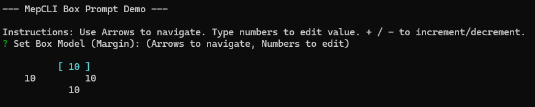
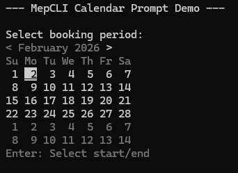
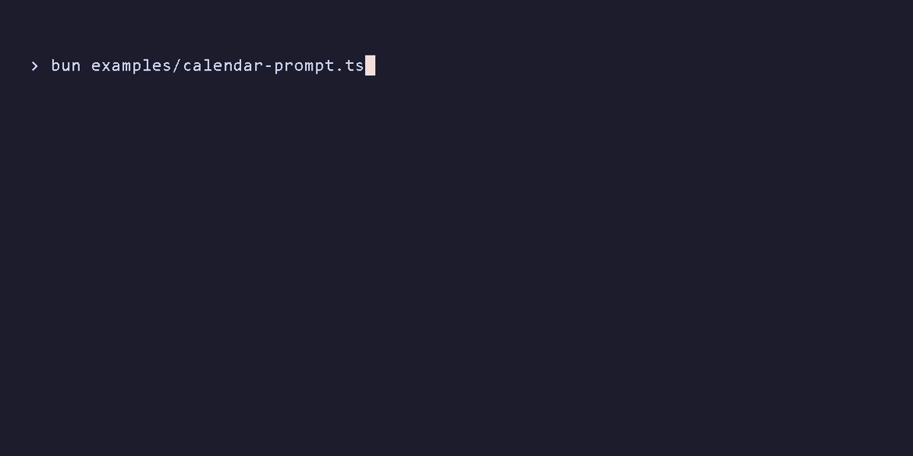
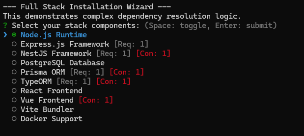
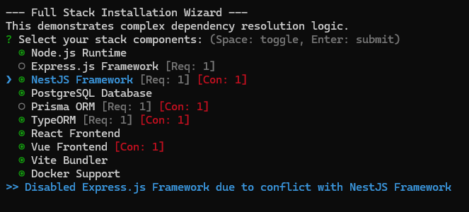
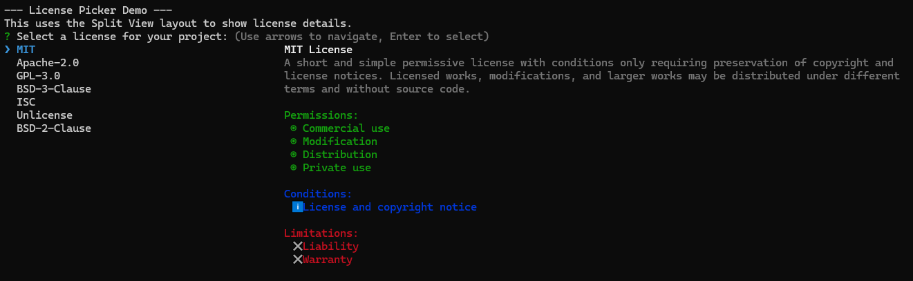
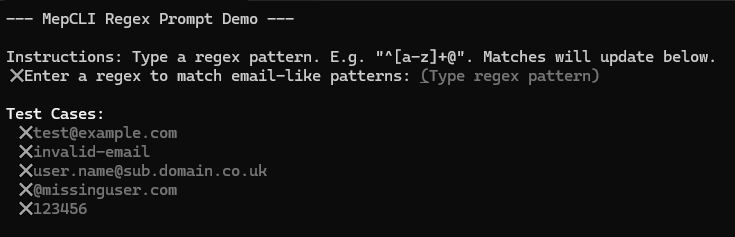
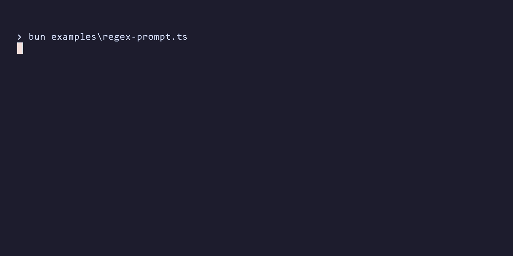

# Mep prompt gallery

This gallery showcases a variety of interactive command-line prompts created using the Mep library. Each example demonstrates different types of prompts and input handling capabilities.

## Examples

### Box Prompt

> *Example media of [Box Prompt](examples/box-prompt.ts)*

### Calendar Prompt

> *Example media of [Calendar Prompt](examples/calendar-prompt.ts)*

### Dependency Prompt

> *Example media of [Dependency Prompt](examples/dependency-prompts.ts)*

### License Prompt

> *Example media of [License Prompt](examples/license-prompts.ts)*

### Regex Prompt

> *Example media of [Regex Prompt](examples/regex-prompt.ts)*