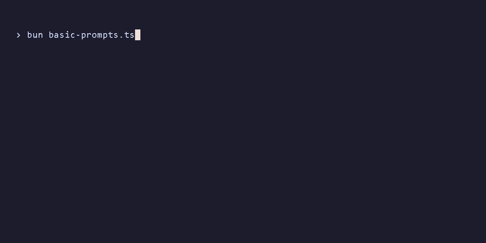

<h1 align="center">Mep</h1>


<p align="center">
  <sub>(Mep <a href="examples/basic-prompts.ts">Basic Prompts</a>)</a></sub>
  
  <sub>(See more <a href="GALLERY.md">gallery</a>)</a></sub>

**Mep** is a lightweight and zero-dependency library for creating interactive command-line prompts in Node.js. It focuses on simplicity, modern design, and robust input handling.

A **CodeTease** project.

## Features

- **Zero Dependency:** Keeps your project clean and fast.
- **Comprehensive:** 60+ prompt types for every need.
- **Mouse Support:** Built-in scroll and click interaction.
- **Responsive:** Fluid cursor movement and validation.
- **Elegant:** Modern ANSI color styling.

## Installation

```sh
npm install mepcli
# or
yarn add mepcli
```

## Quick Start

```typescript
import { MepCLI } from 'mepcli';

async function main() {
    // 1. Text Input
    const name = await MepCLI.text({
        message: "What's your name?",
        placeholder: "John Doe"
    });

    // 2. Select Menu
    const lang = await MepCLI.select({
        message: "Choose language:",
        choices: [
            { title: "JavaScript", value: "js" },
            { title: "TypeScript", value: "ts" }
        ]
    });

    // 3. Confirm
    const ready = await MepCLI.confirm({
        message: "Ready to deploy?"
    });

    console.log({ name, lang, ready });
}

main();
```

> 💡 **Want more?** Check out the full feature demo in [`example.ts`](example.ts) or browse the `examples/` directory.

## Prompt Types 

### 🔹 The Basics
Essential prompts for everyday input.

| Function | Description |
| :--- | :--- |
| `text` | Single line or multiline text input. |
| `password` | Masked text input (`***`). |
| `secret` | Completely hidden text input. |
| `number` | Numeric input with increment/decrement. |
| `confirm` | Yes/No question. |
| `toggle` | On/Off switch (True/False). |
| `select` | Single item selection from a list. |
| `list` | Enter a list of tags/strings. |

### 🔹 Selection & Pickers
Powerful tools for selecting dates, files, colors, and more.

| Function | Description |
| :--- | :--- |
| `checkbox` | Multiple choice selection. |
| `multiSelect` | Multiple selection with filtering. |
| `multiColumnSelect` | Selection with grid layout. |
| `fuzzySelect` | Selection with fuzzy search. |
| `autocomplete` | Async searchable selection. |
| `selectRange` | Select a continuous range (start-end). |
| `treeSelect` | Hierarchical multi-selection. |
| `grid` | 2D matrix selection (rows x columns). |
| `seat` | Seat selection map with gaps. |
| `emoji` | Emoji picker with history. |
| `color` | RGB/Hex color picker. |
| `date` | Date and time picker. |
| `calendar` | Interactive calendar for dates/ranges. |
| `time` | Time picker. |
| `file` | File system navigator. |
| `breadcrumb` | Breadcrumb navigation style. |
| `miller` | Miller columns navigation. |
| `tree` | Hierarchical tree navigation. |

### 🔹 Advanced Layouts
Complex interfaces for structured data.

| Function | Description |
| :--- | :--- |
| `table` | Display data in columns and select rows. |
| `spreadsheet` | Interactive table editor. |
| `inspector` | JSON data explorer/editor. |
| `schedule` | Gantt chart timeline. |
| `kanban` | Kanban board (Drag & Drop). |
| `heatmap` | Grid intensity selector. |
| `sort` | Reorder a list of items. |
| `sortGrid` | Rearrange items in a 2D grid. |
| `transfer` | Move items between two lists. |
| `match` | Link items between source and target. |
| `map` | Key-Value editor. |
| `form` | Multi-field input form. |
| `snippet` | Template string filling. |
| `cron` | Cron schedule builder. |
| `code` | Code/JSON editor with syntax highlighting. |

### 🔹 Specialized Inputs
 tailored for specific data formats.

| Function | Description |
| :--- | :--- |
| `ip` | IPv4 address input. |
| `semver` | Semantic versioning bumper. |
| `otp` | One Time Password (PIN) input. |
| `byte` | Byte size input (KB, MB, GB). |
| `rating` | Star rating input. |
| `slider` | Visual numeric slider. |
| `range` | Dual-handle slider (min-max). |
| `dial` | Rotary knob for numeric input. |
| `calculator` | Math expression evaluator. |
| `region` | ASCII map region selector. |
| `pattern` | Android-style pattern lock. |
| `dependency` | Checkbox with logic (Depends/Conflict). |
| `license` | License picker with Split View. |
| `regex` | Real-time regex validator. |
| `box` | Box model (CSS Margin/Padding) editor. |
| `connectionString` | Database URL wizard. |
| `curl` (experimental) | Interactive HTTP request builder. |

### 🔹 Gamified & Fun
Add some personality to your CLI.

| Function | Description |
| :--- | :--- |
| `slot` | Slot machine randomizer. |
| `gauge` | Rhythm/accuracy game. |
| `draw` | Braille canvas drawing. |
| `quizSelect` | Multiple choice quiz. |
| `quizText` | Text answer quiz. |
| `spam` | Mash keys to confirm (fun mode). |

### 🔹 Utilities
Helper functions for better CLI UX.

| Function | Description |
| :--- | :--- |
| `exec` (experimental) | Run shell command with spinner. |
| `scroll` | Scrollable text viewer (e.g., License). |
| `diff` | Text merge conflict resolver. |
| `editor` | Open external editor (Vim/Nano). |
| `shortcut` | Record key combinations. |
| `keypress` | Wait for a specific key press. |
| `wait` | Pause for a few seconds. |
| `spinner` | Simple loading spinner control. |

## Keyboard & Mouse Support

MepCLI automatically detects modern terminals and enables **Mouse Tracking** (using SGR 1006 protocol) for scrolling and clicking.

### ⌨️ Advanced Shortcuts

<details>
<summary><b>Calendar Prompt</b></summary>

Mep's Calendar prompt supports advanced navigation and selection shortcuts for power users.

*   **Keyboard:**
    *   `Arrow Keys`: Move cursor day by day.
    *   `PageUp` / `PageDown`: Jump to previous/next **Month**.
    *   `Ctrl + Up` / `Ctrl + Down`: Jump to previous/next **Year**.
    *   `Home` / `End`: Jump to the first/last day of the current month.
    *   `t`: Jump immediately to **Today**.
    *   `Enter`: Select date (or start/end of range).

*   **Mouse:**
    *   `Scroll`: Navigate **Months**.
    *   `Ctrl + Scroll`: Adjust the selected **Day** (cursor movement).

</details>

<details>
<summary><b>Color Prompt</b></summary>

*   **Keyboard:**
    *   `Tab`: Switch between RGB channels.
    *   `Up` / `Down`: Move between channels.
    *   `Left` / `Right`: Adjust current channel value.
    *   `Shift + Left` / `Shift + Right`: Fast adjust current channel value.

*   **Mouse:**
    *   `Scroll`: Adjust the current channel value.
    *   `Ctrl + Scroll`: Fast adjust.

</details>

<details>
<summary><b>Checkbox Prompt</b></summary>

*   **Keyboard:**
    *   `Space`: Toggle selection.
    *   `a`: Select **All**.
    *   `x` / `n`: Select **None**.
    *   `i`: **Invert** selection.

</details>

<details>
<summary><b>MultiSelect Prompt</b></summary>

*   **Keyboard:**
    *   `Space`: Toggle selection.
    *   `Ctrl + A`: Select **All** (Visible).
    *   `Ctrl + X`: Deselect **All** (Visible).
    *   `Typing`: Filter list.

</details>

<details>
<summary><b>Transfer Prompt</b></summary>

*   **Keyboard:**
    *   `Tab` / `Left` / `Right`: Switch focus between Source and Target.
    *   `Space`: Move selected item.
    *   `a` / `>`: Move **All** to Target.
    *   `r` / `<`: Move **All** to Source (Reset).

</details>

<details>
<summary><b>Tree & TreeSelect Prompt</b></summary>

*   **Keyboard:**
    *   `Right`: Expand folder or jump to child.
    *   `Left`: Collapse folder or jump to parent.
    *   `Space`: Toggle expansion (Tree) or Checkbox (TreeSelect).
    *   `e`: **Expand** all recursively.
    *   `c`: **Collapse** all recursively.

</details>

<details>
<summary><b>Grid Prompt</b></summary>

The Grid prompt (Matrix selection) includes robust shortcuts for bulk actions.

*   **Keyboard:**
    *   `Arrow Keys`: Move cursor.
    *   `PageUp` / `PageDown`: Jump to the first/last **Row**.
    *   `Home` / `End`: Jump to the first/last **Column**.
    *   `Space`: Toggle current cell.
    *   `r`: Toggle entire **Row**.
    *   `c`: Toggle entire **Column**.
    *   `a`: Select **All**.
    *   `x`: Deselect **All** (None).
    *   `i`: **Invert** selection.

*   **Mouse:**
    *   `Scroll`: Vertical navigation (Rows).
    *   `Shift + Scroll`: Horizontal navigation (Columns).

</details>

<details>
<summary><b>Map Prompt</b></summary>

*   **Keyboard:**
    *   `Ctrl + N`: Add new row.
    *   `Ctrl + D`: Delete current row.
    *   `Arrows` / `Tab`: Navigate cells.

</details>

<details>
<summary><b>IP Prompt</b></summary>

*   **Keyboard:**
    *   `typing...`: Auto-jumps to next octet after 3 digits or `.`.
    *   `Backspace`: Navigates back to previous octet if empty.

</details>

<details>
<summary><b>Kanban Prompt</b></summary>

*   **Keyboard:**
    *   `Arrows`: Navigate items/columns.
    *   `Space`: Grab/Drop item (Drag & Drop mode).
    *   `Enter`: Submit.

*   **Mouse:**
    *   `Scroll`: Navigate items (Normal) or Move item Left/Right (Grabbed).

</details>

<details>
<summary><b>Time Prompt</b></summary>

*   **Keyboard:**
    *   `Up` / `Down`: Adjust value.
    *   `Left` / `Right` / `Tab`: Switch unit (Hour/Minute/AM-PM).

*   **Mouse:**
    *   `Scroll`: Adjust value (Up/Down).

</details>

<details>
<summary><b>Heatmap Prompt</b></summary>

*   **Keyboard:**
    *   `Arrows`: Navigate cells.
    *   `Tab` / `Shift+Tab`: Navigate cells (Horizontal).
    *   `Space`: Cycle value.
    *   `0-9`: Set value directly.

*   **Mouse:**
    *   `Scroll`: Navigate rows (Vertical).

</details>

<details>
<summary><b>Emoji Prompt & MultiColumnSelect</b></summary>

*   **Keyboard:**
    *   `Arrows`: Navigate grid.
    *   `Typing`: Filter/Search (Emoji only).

</details>

<details>
<summary><b>Miller Prompt</b></summary>

*   **Keyboard:**
    *   `Up` / `Down`: Navigate items.
    *   `Right` / `Enter` / `Tab`: Expand child or Drill down.
    *   `Left` / `Shift + Tab`: Collapse or Go back.

</details>

<details>
<summary><b>Match Prompt</b></summary>

*   **Keyboard:**
    *   `Arrows`: Navigate lists.
    *   `Tab`: Switch Source/Target.
    *   `Space`: Pick Source or Toggle Link.

</details>

<details>
<summary><b>Diff Prompt</b></summary>

*   **Keyboard:**
    *   `Left` / `Right`: Switch Action (Original / Modified / Edit).
    *   `Enter`: Submit selection.

</details>

<details>
<summary><b>Dial Prompt</b></summary>

*   **Keyboard:**
    *   `Arrows`: Adjust value (rotate knob).
    *   `Enter`: Submit.

*   **Mouse:**
    *   `Scroll`: Adjust value.

</details>

<details>
<summary><b>Draw Prompt</b></summary>

*   **Keyboard:**
    *   `Arrows`: Move cursor.
    *   `Space`: Toggle pixel.
    *   `c`: Clear canvas.
    *   `i`: Invert canvas.
    *   `Enter`: Submit.

*   **Mouse:**
    *   `Drag`: Paint (Left Click) or Erase (Right Click).
    *   `Click`: Toggle pixel.

</details>

<details>
<summary><b>Breadcrumb Prompt</b></summary>

*   **Keyboard:**
    *   `Arrows`: Navigate list.
    *   `Enter`: Drill down into folder.
    *   `Backspace`: Go up one level.

*  **Mouse:**
    *   `Scroll`: Navigate list.

</details>

<details>
<summary><b>Schedule Prompt</b></summary>

*   **Keyboard:**
    *   `Arrows`: Move task in time.
    *   `Tab` / `Shift + Tab`: Switch between tasks.
    *   `Shift + Left/Right`: Resize task duration.
    *   `PageUp` / `PageDown`: Scroll timeline horizontally.

* **Mouse:**
    *   `Scroll`: Scroll timeline horizontally.

</details>

<details>
<summary><b>Data Inspector</b></summary>

*   **Keyboard:**
    *   `Space` / `Arrows`: Expand/Collapse nodes.
    *   `Enter`: Toggle Boolean or Edit String/Number.

*   **Mouse:**
    *   `Scroll`: Navigate tree.

</details>

<details>
<summary><b>Seat Prompt</b></summary>

*   **Keyboard:**
    *   `Arrows`: Navigate seat grid.
    *   `Tab` / `Shift+Tab`: Navigate Left/Right.
    *   `Space`: Select/Deselect seat.

*   **Mouse:**
    *   `Scroll`: Navigate Up/Down.

</details>

<details>
<summary><b>Select Range Prompt</b></summary>

*   **Keyboard:**
    *   `Arrows (Up/Down)`: Navigate items.
    *   `Space`: Set/Unset anchor point.
    *   `Enter`: Submit selected range.

</details>

<details>
<summary><b>Sort Grid Prompt</b></summary>

*   **Keyboard:**
    *   `Arrows`: Navigate grid.
    *   `Tab` / `Shift+Tab`: Navigate Left/Right.
    *   `Space`: Grab/Drop item.
    *   `Enter`: Submit grid.

*   **Mouse:**
    *   `Scroll`: Navigate Up/Down.

</details>

<details>
<summary><b>Dependency Prompt</b></summary>

*   **Keyboard:**
    *   `Arrows`: Navigate items.
    *   `Space`: Toggle item (Triggers auto-resolution).
    *   `Enter`: Submit selection.

*   **Mouse:**
    *   `Scroll`: Navigate Up/Down.

</details>

<details>
<summary><b>Box Prompt</b></summary>

*   **Keyboard:**
    *   `Arrows` / `Tab`: Navigate (Top -> Right -> Bottom -> Left).
    *   `Shift + Tab`: Navigate backwards.
    *   `+` / `-`: Increment/Decrement value.
    *   `0-9`: Type value directly.

*   **Mouse:**
    *   `Scroll`: Cycle focus (Up=Backwards, Down=Forwards).

</details>

## License

This project is under the **MIT License**.